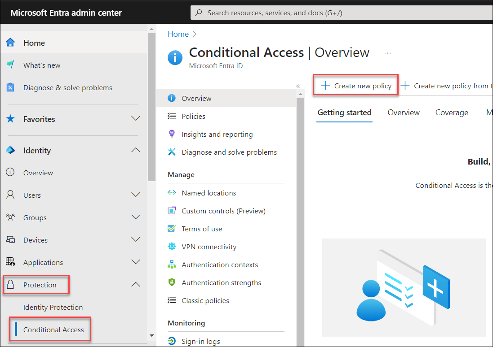
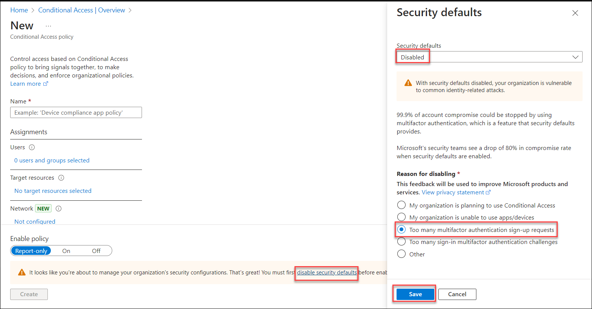
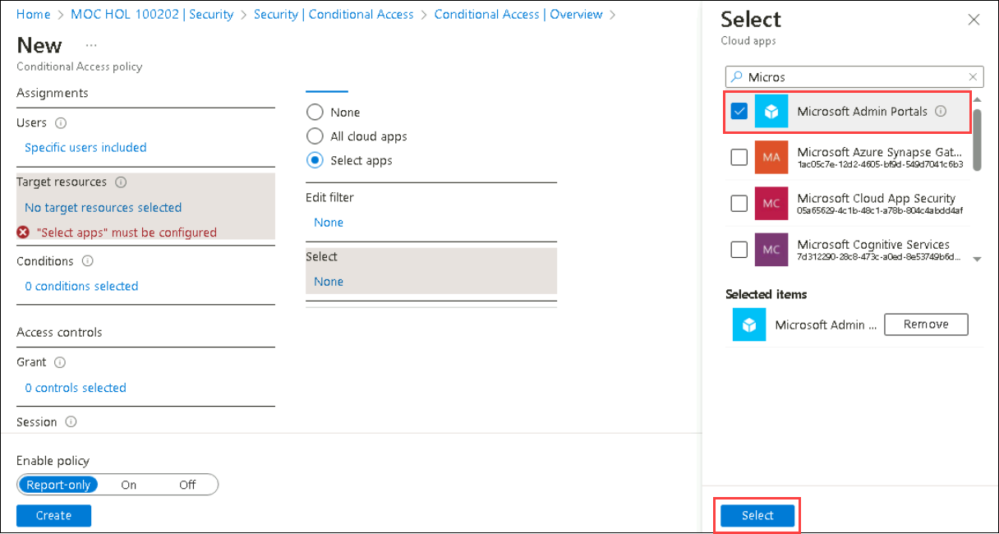
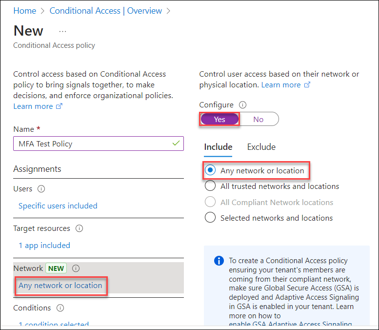
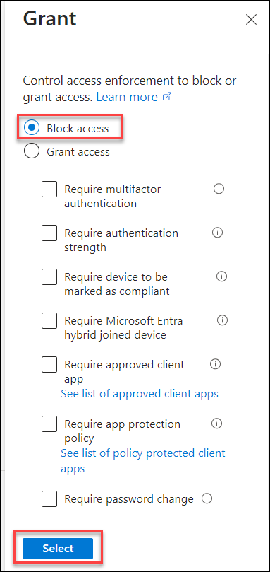
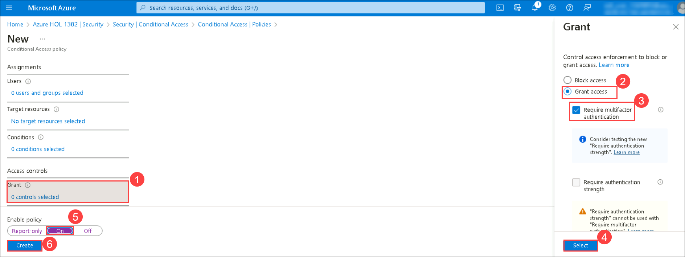
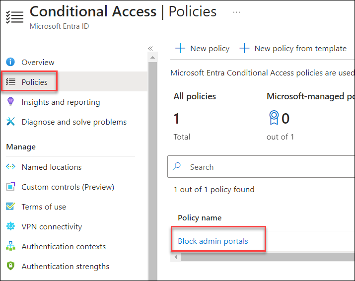
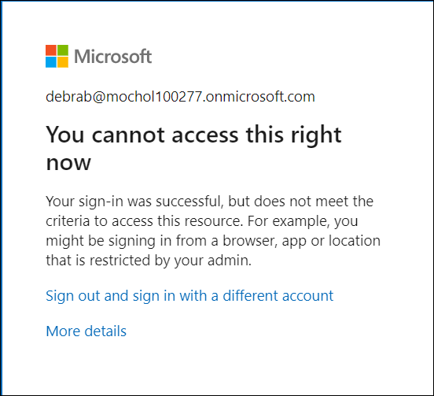

# Lab-03 : Microsoft Entra Conditional Access

## Lab scenario
In this lab, you will explore conditional access MFA, from the perspective of an admin and a user.  As the admin will create a policy that will require a user to go through multi-factor authentication when accessing a cloud-based Microsoft Azure Management application.  From a user perspective, you will see the impact of the conditional access policy, including the process to register for MFA.

## Lab objectives

In this lab, you will complete the following tasks:

+ Task 1: Reset the password for the user
+ Task 2: Process of creating a conditional access policy in Microsoft Entra ID
+ Task 3: Impact of the conditional access policy

## Estimated timing: 30 minutes

## Architecture diagram

## Task 1:  Reset the password for the user

In this task, you, as the admin, will reset the password for the user Debra Berger.  This step is needed so you can initially sign in as the user in subsequent tasks.

1. Open Microsoft Edge, and in the address bar, enter **https://entra.microsoft.com**, and sign in. 

1. On **Sign in to Microsoft Azure** blade, you will see a login screen, in that enter the following email/username and then click on **Next**.
   
   * Email/Username: <inject key="AzureAdUserEmail"></inject>

1. Now enter the following password and click on **Sign in**.
   
   * Password: <inject key="AzureAdUserPassword"></inject>

1. On the **Stay signed in ?** select **No**.   

1. From the left navigation pane, expand **Identity**, expand **Users**, then select **All users**.

1. Select **Debra Berger** from the list of users.

1. Select **Reset password** from the top of the page. Since you have not previously signed in as Debra Berger you don’t know her password and will need to reset the password.

1. When the password reset window opens, select **Reset Password** and copy the password.

   >**Note**: Kindly make a note of the new password, as you will need it in a subsequent task, to be able to sign in as the user.
   >**Note**: Make a note of the User principal name, as you will need it in a subsequent task, to be able to sign in as the user.

1. Close the password reset window by selecting the X at the top right corner of the page, then close out of the Debra Berger window by selecting the X at the top right corner of the page.

1. From the left navigation panel, select Home to return the home page for the Microsoft Entra admin center.

1. Keep the browser page open, as you will in the subsequent tasks.

## Task 2: Process of creating a conditional access policy in Microsoft Entra ID

 In this task, you will go through the process of creating a conditional access policy in Microsoft Entra ID. 

1. Open the browser tab to the home page of the Microsoft Entra admin center. If you previously closed the browser tab, open Microsoft Edge and in the address bar enter **https://entra.microsoft.com** and sign in. 

1. From the left navigation pane, expand **Protection** then select **Conditional Access** and click on **+ Create new policy**. 

   
   
   >**Note**: If you see a message at the bottom "It looks like you're about to manage your organization's security configurations. That's great! You must first disable security defaults before enabling a Conditional Access policy", click on **Disable security defaults**, and select **Disable** from the drop down menu.
   > 

1. Enter the following details,

    - In the Name field, enter **Block admin portals**.

    - Under Users, select **0 users and groups selected**.

    - You will now see the option to Include or Exclude users or groups.  Make sure **Include** is selected (underlined).

    - Select the option for **Select users and groups** and select **Users and groups**.  The window to select users and groups opens.

      .png)
   
1. In the Search bar, enter **Debra**.  Select **Debra Berger** from beneath the search bar, then press the **Select** button on the bottom of the page.  Note, a common practice is to assign the policy to users in a group.  For the purpose of expediency with this lab, we will assign the policy to a specific user. 

    

1. Under **Target resources**, select **No target resources are selected**.

1. You will now see the option to Include or Exclude cloud apps or user actions.  Make sure **Cloud apps** is highlighted and **Include** is selected (underlined), then select **Select apps**.  under **Select** click on **None**, then the window to Select Cloud apps opens.

1. In the search bar, Type/Search and select **Microsoft admin portals**, then press **Select** at the bottom of the page.  Notice the warning.  
    
    

1. Under Network, select **Any network or location**.  Review the options but do not select any options.
   
    

1. Under Conditions, select **0 conditions selected**.  Notice the different options you can configure.  Through the policy, you can control user access based on signals from conditions like risk, device platform, location, client apps, or device state.  For example, you could include a condition for the policy to apply for any location except selected or trusted locations such as your headquarters’ network.  For this policy, do not set any conditions.

1. Now you will set the access controls.  Under Grant, select **0 controls selected**.

1. The Grant window opens.  Ensure **Block access** is selected and then press **Select** at the bottom of the page.

    

1. At the bottom of the page, Under Enable policy, select **On**, then press the **Create button**.

    

1. After a few seconds, the **Block admin portals** policy should appear in the list of conditional access policies (if needed, select **Refresh** at the top of the page).

    

1. Sign out of Azure and close your browser windows.

## Task 3: Impact of the conditional access policy

In this task, you will see the impact of the conditional access policy, from the perspective of the user, Debra Berger. You will start first by signing in to an application that is not included in the conditional access policy.  Then you will repeat the process for an application that is included in the conditional access policy.  Recall that the policy blocks accessing any of the Microsoft Admin Portals, including the Azure portal.

1. Open Microsoft Edge.  In the address bar of the browser, enter **https://login.microsoftonline.com/**.

1. Sign in as Debra Burger,
    1. In the Sign in window enter **debrab@xxxxxx.onmicrosoft.com** (where xxxxxx can be found in the Environment Details Tab in the Lab Guide section) then select **Next**.
    1. Enter the password you noted in the earlier task. Select **Sign in**.
    1. Since the password provided when you, as the admin, reset the password is temporary you need to update your password.  Enter the current password, then for the new password and confirm password fields enter **SC900-Lab**.
    1. When prompted to stay signed- in, select **Yes**

1. You should be successfully logged in to your Microsoft 365 account. 

1. Now you will attempt to sign in to an application that meets the criteria for Conditional Access policy.  Open Microsoft Edge and in the address bar, enter **https://portal.azure.com**. 

1. A pop-up window appears indicating "You don't have access to this."  This is a result of the conditional access policy that blocks your access to all Microsoft admin portals.

   

1. Sign out by selecting the user icon next to the email address on the top right corner of the screen and selecting Sign out. Then the close all the browser windows.
   
   > **Congratulations** on completing the task! Now, it's time to validate it. Here are the steps:
    - If you receive a success message, you can proceed to the next task.
    - If not, carefully read the error message and retry the step, following the instructions in the lab guide.
    - If you need any assistance, please contact us at cloudlabs-support@spektrasystems.com. We are available 24/7 to help you out.

   <validation step="b9582d28-5224-4989-bd2e-79d113c4f946" />   

## Review
In this lab, you have completed:
- Reset the password for the user
- Process of creating a conditional access policy in Azure AD
- Impact of the conditional access policy
  
## You have successfully completed the lab
