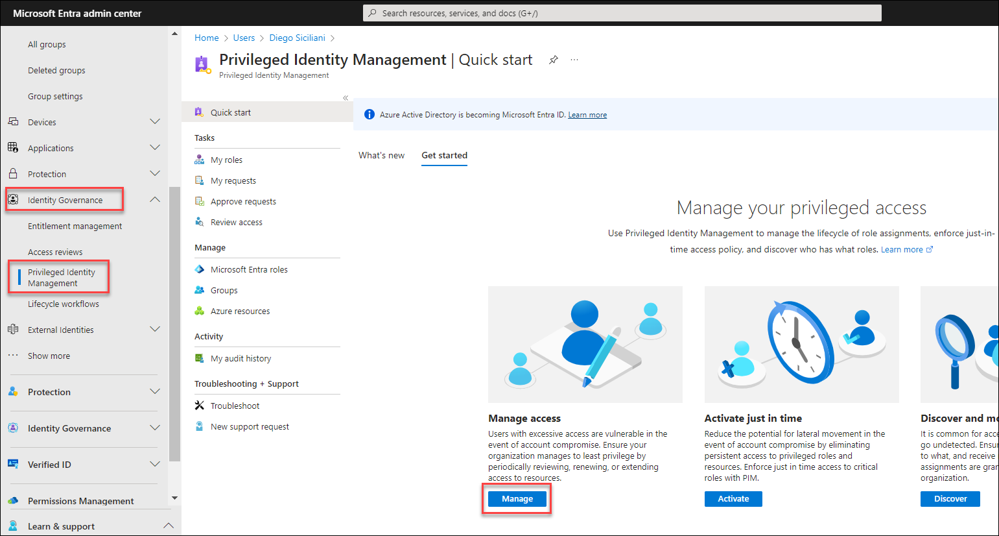
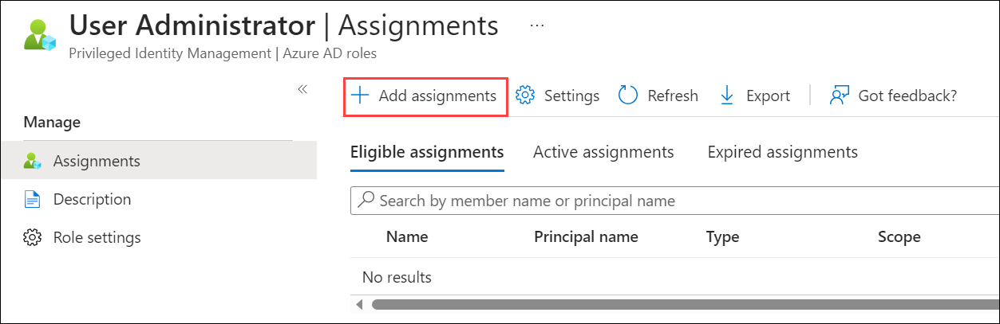
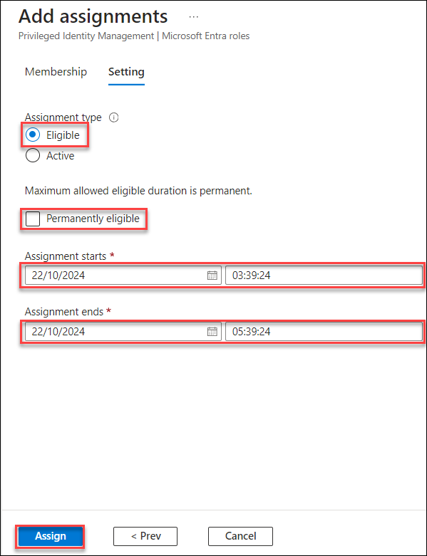
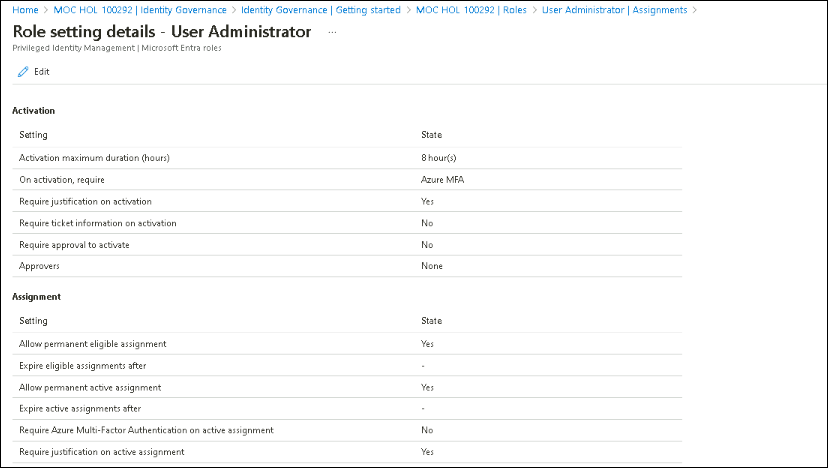
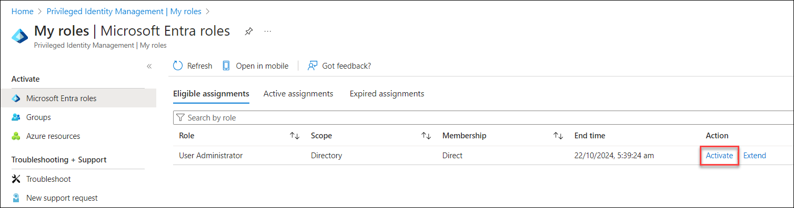
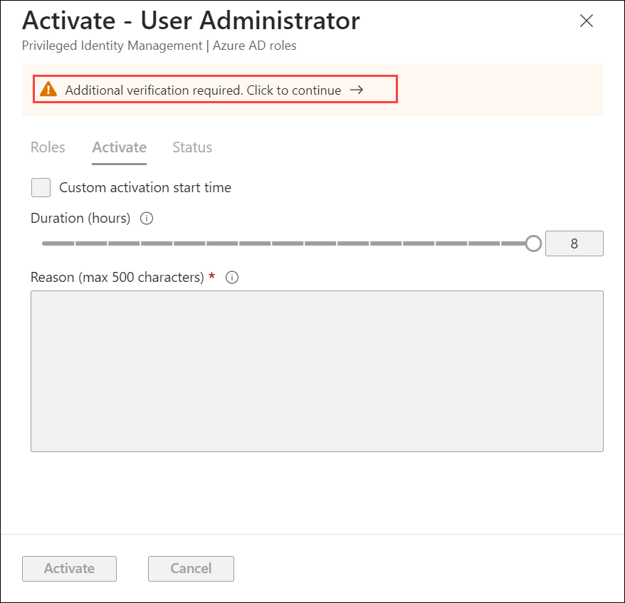
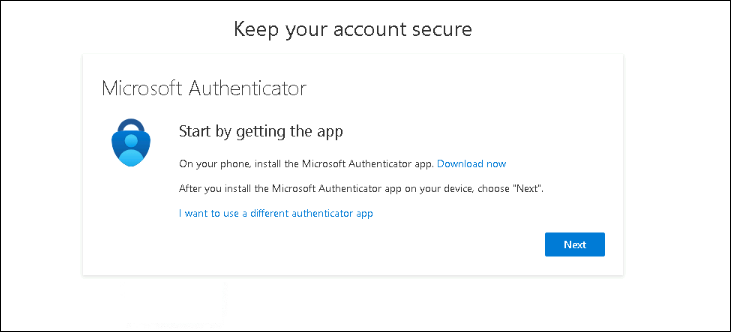
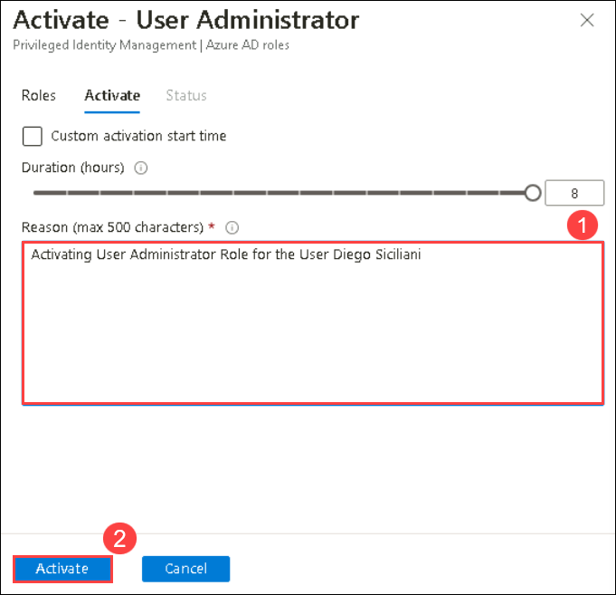
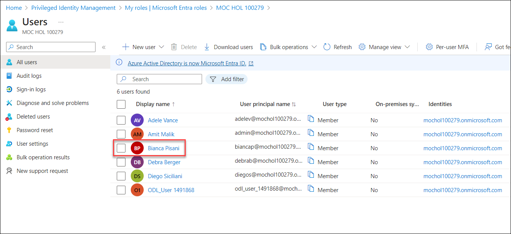
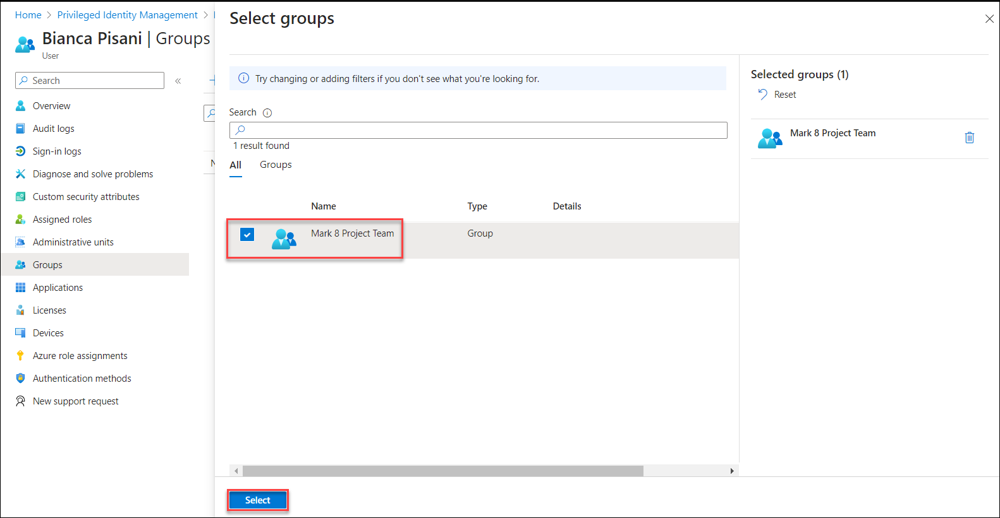

# Lab-04: Explore identity governance in Azure AD with Privileged Identity management

## Lab scenario
In this lab, you will explore some of the basic functionality of Privileged Identity Management (PIM). PIM does require Microsoft Entra ID P2 license.  In this lab, you, as the admin, will configure one of your users, Diego Siciliani, with an Azure AD user administrator role, through Privileged ID management (PIM).   With user admin privileges, Diego will be able to create users and groups manage licenses and more. Both the admin and the user, Diego, must be configured for the Microsoft Entra ID P2 license.

## Lab objectives

In this lab, you will complete the following tasks:

+ Task 1: Reset the password for the user
+ Task 2: Assign an Azure AD role in Privileged Identity Management
+ Task 3: Sign in to the Microsoft Entra Admin Center to access the Privileged Identity Management

## Estimated timing: 60 minutes

## Architecture diagram

## Task 1: Reset the password for the user

In this task, you, as the admin, will reset the password for the user Diego Siciliani. This step is needed so you can initially sign in as the user in subsequent tasks.
 
1. Open Microsoft Edge, and in the address bar, enter **https://entra.microsoft.com**.
   
1. On **Sign in to Microsoft Azure** blade, you will see a login screen, in that enter the following email/username and then click on **Next**. 

   * Email/Username: <inject key="AzureAdUserEmail"></inject>
   
1. Now enter the following password and click on **Sign in**.

   * Password: <inject key="AzureAdUserPassword"></inject>
   
1. From the left navigation panel, expand **Identity**, expand **Users**, then select **All users**.  

1. Select **Diego Siciliani** from the list of users.

1. Select **Reset password** from the top of the page. Since you haven't previously signed in as Diego, you don’t know his password, and will need to reset the password.

1. When the password reset window opens, select **Reset Password** and copy the password.

   >**Note**: Kindly make a note of the new password, as you will need it in a subsequent task, to be able to sign in as the user.
           
1. From the left navigation panel, select **Home** to return the home page for the Microsoft Entra admin center.

1. Keep the browser page open, as you will in the subsequent tasks.

## Task 2: Assign an Azure AD role in Privileged Identity Management

In this task, you, as the admin, will assign Diego an Azure AD role in Privileged Identity Management.

1. Open the browser tab for the home page of the Microsoft Entra admin center.  

1. From the left navigation panel, under "Identity", expand **Identity Governance**, then select **Privileged Identity Management**, and in the Get started page, select **Manage** under Manage access.

   

1. You're now in the Roles page.  In the search bar, on the top of the page, enter **user**.  From the search results, select **User Administrator**.

   

1. From the top of the page, select **+ Add Assignments**.

   

1. In the Add assignments page, ensure that **Membership** is underlined.  Here you will configure the membership settings for the user administrator role in PIM.

1. Leave the Scope type to its default value, Directory.  

1. Under Select members, select **No members selected**. This opens the Select a member window. 

1. In the search bar, enter **Diego**.  From the search results, select **Diego Siciliani** then press **Select** on the bottom of the page.  

1. Under Select members you will see 1 Member(s) selected and the name and email of the selected member(s), Deigo Siciliani. From the bottom of the Add assignments page, select **Next**.

1. You are now on the Setting page.  Leave the Assignment type to the default setting, **Eligible**.

1. If the Permanently eligible box is checked, select **Permanently eligible**, to remove the checkmark.

1. In the Assignment start fields, keep the default date and time, which are today and the current time.

1. In the Assignment end fields, change the date to today’s date (note the default setting is one year from today, so you need to change the year). For the time, set the time to two hours from the current time.  After you have set the time field for the time when the Assignment ends, press the tab key on your keyboard and select **Assign** at the bottom of the page.  

    

1. This takes you back to the Assignments window.  After a few seconds, you should see Diego Siciliani listed in the User Administrator table, along with the details of the assignment.  If after a few seconds you still don't see the update, select **Refresh** from the top of the page.

1. From the top of the page, select **Settings**.

1. In the Role setting details for the User Administrator, notice the different options.  Note that the setting to “Require justification on activation” is set to yes, and “On activation, require Azure MFA” is also set.  You will see both of these in the next task when Diego activates the role.  Also, note that “Require approval to activate” is set to No.  Leave all the settings to their default values.  Close the page by selecting the **X** on the top right corner of the screen.

   

1. Sign out by selecting the user icon next to the email address on the top right corner of the screen and selecting **Sign out**. Then the close all the browser windows.

   > **Congratulations** on completing the task! Now, it's time to validate it. Here are the steps:
    - If you receive a success message, you can proceed to the next task.
    - If not, carefully read the error message and retry the step, following the instructions in the lab guide.
    - If you need any assistance, please contact us at cloudlabs-support@spektrasystems.com. We are available 24/7 to help you out.
  
      <validation step="3bf29fd2-7b87-4aad-bd94-71ff0483cd5f" />
  
## Task 3: Sign in to the Azure Portal, to access the Privileged Identity Management

In this task you, as Diego Siciliani, will sign in to Microsoft Entra admin center, to access the Privileged Identity Management capability of Microsoft Entra to activate your assignment as User administrator. Once activated you'll make some configuration changes to an existing user. 

> Note: For this task, you'll need access to a mobile device to use with the Microsoft Authenticator app.

1. Open Microsoft Edge. In the address bar of the browser, enter **Entra.microsoft.com**.

1. Sign in as Diego Siciliani.
   
    1. In the Sign in window enter **diegos@azureholxxxx.onmicrosoft.com** (user email id of the Diego Siciliani  ) then select **Next**.
    1. Enter the temporary password that you noted from the previous task and select **Sign in**.  Select **Sign in**.
    1. Since the password you entered was only a temporary password you need to update it now. Enter the current password.  For the new password and confirm password fields enter **SC900-Lab** and select **Sign in**
    1. When prompted to stay signed- in, select **Yes**.

1. From the left navigation panel, expand **Identity Governance** then select **Privileged Identity Management**.
   
1. From the left navigation panel, select **My roles**. You're now seeing information for your eligible assignments. You'll see that you, Diego, are assigned the User administrator role.

1. In the last column of the table, labeled action, select **Activate**.

    

1. You will see a warning icon indicating Additional verification is required.  Select **Click to continue**.  Recall that the PIM settings for the User administrator role require multi-factor authentication.  Additionally, since Diego’s contact information for use with MFA (authentication methods) was not previously configured, he must register his information, to be able to use MFA.  Although he will have to do MFA anytime he signs in as a user admin, within the assignment period, the MFA registration process is required only once. 

    

1. You are notified that more information is required, select **Next**.

1. The window that appears and the steps that follow are for the Microsoft Authenticator app method. .
    1. If you already have the Microsoft Authenticator app installed on your mobile device select **Next**. Otherwise, select **Download now** and follow the steps.
    1. You'll begin to setup your account.  Select **Next**.
    1. Using the Microsoft Authenticator app on your mobile device, select the **+** to add an account and select **Work or school account**.
    1. Select the option to **Scan the QR code**, then using your mobile device, scan the QR code on your PC screen .
    1. Using the Microsoft Authenticator app on your mobile device, scan the QR code.
    1. Follow the steps on your PC and mobile device, then select **Next**.
    1. Once you've setup your security info, you'll see a Success window.  Select **Done**.

    

1. The Activate User Administrator window appears.  You are required to enter a reason for the activation.  In the box that appears, enter any reason you want (max of 500 characters), then select **Activate**.

    

1. You will see the status (3 stages of progress), as the activation is processed.

    

1. Once the activation is completed you are returned to the My roles | Azure AD roles page, where you will see a notification stating you have just activated a role.  Select **Click here** to view your active roles.  If you notice the end time is different than what was originally configured, select the refresh key on the top of the page (it may take a few minutes to refresh).
   
1. Return to the home page of the Microsoft Entra admin center by selecting **Home** from the left navigation panel. 
   
1. As a Microsoft Entra ID user administrator, you can create users and groups, manage licenses, and more. From the left navigation panel, expand **Identity**, select **All Users**.
   
1. From the users list, select **Bianca Pisani**.

    
   
1. From the left navigation panel, select **Groups**.

1. Notice the groups to which Bianca is already assigned. From the top of the page, select **+ Add Memberships**.

1. From the list of groups, select **Mark 8 Project Team**.

1. From the bottom of the page, select **Select**.

    

1. On the Groups page, notice that the Mark 8 Project Team group has been added to the list (if you don't immediately see it it listed, select teh **Refresh** button).

1. Sign out by selecting on the user icon next to the email address on the top right corner of the screen and selecting **Sign out**. Then the close all the browser windows.
   
1. The duration of the user admin role is limited to the time that was configured.

   > **Congratulations** on completing the task! Now, it's time to validate it. Here are the steps:
    - If you receive a success message, you can proceed to the next task.
    - If not, carefully read the error message and retry the step, following the instructions in the lab guide.
    - If you need any assistance, please contact us at cloudlabs-support@spektrasystems.com. We are available 24/7 to help you out.
  
      <validation step="8e3654ca-357a-4da8-b947-b5b897cd526b" />

## Review
In this lab, you have completed:
- Reset the password for the user
- Assign an Azure AD role in Privileged Identity Management
- Sign in to the Azure Portal, to access the Privileged Identity Management
  
## You have successfully completed the lab

