# Lab-09: Explore the Microsoft 365 Defender portal

## Lab scenario
In this lab you will explore the Microsoft 365 Defender portal by walking through the content displayed on the landing page. You will also explore the options on the navigation panel which provide quick access to functionality that is part of Microsoft’s Extended Detection and Response (XDR) solution: Microsoft Defender for Endpoints, and Microsoft Defender for Office 365 (email and collaboration).  Lastly you will also explore how Microsoft Secure Score can help an organization improve its security posture.

## Lab objectives

In this lab, you will complete the following tasks:

+ Task 1: Explore the Microsoft 365 Defender landing page
+ Task 2: Explore on Microsoft Secure Score

## Estimated timing: 30 minutes

## Architecture diagram

## Task 1:  Explore the Microsoft 365 Defender landing page

1. Open Microsoft Edge. In the address bar enter **admin.microsoft.com**.

1. In the Sign-in window, enter the following **email/username** and click on Next.

    * Email/Username: <inject key="AzureAdUserEmail"></inject>

1. Now enter the **password** and click on Sign in.
   
   * Password: <inject key="AzureAdUserPassword"></inject>
  
1. When prompted to stay signed-in, select **Yes**. This takes you to the Microsoft 365 admin center page.

1. From the left navigation pane of the Microsoft 365 admin center, select **Show all**, and then select **Security** under **Admin centers**.

     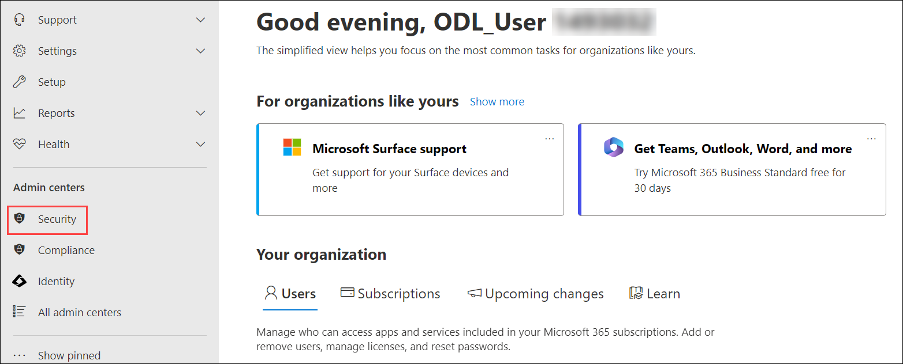

1. A new browser page opens. Since you are already signed in, your email will be listed. You can select your email address, <inject key="AzureAdUserEmail"></inject> to log in to the Microsoft Defender portal. 

     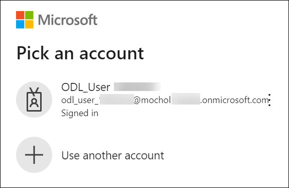

1. If this is your first time visiting the Microsoft 365 Defender portal, you may see a pop-up window offering a quick tour or **information** about the Microsoft Defender portal. Select **Take a quick tour**. Read the description provided in each pop-up window, then select **Next**. Continue through the tour until you get to the end, then select **Done**.

     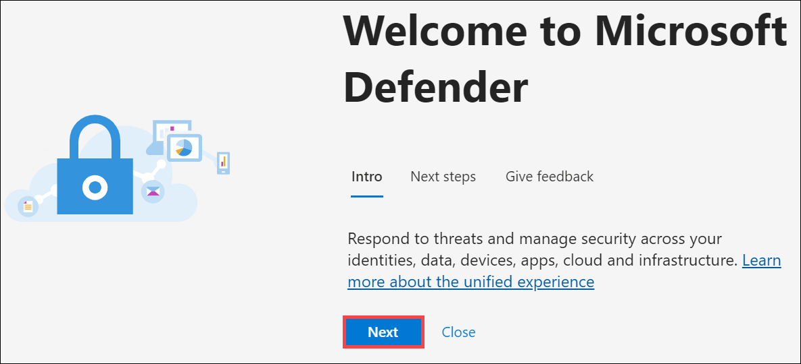

1. The welcome page of the Microsoft 365 Defender portal, shows many of the common cards that security teams need. The composition of cards and data is dependent on the user role. Scroll through the page to view the default set of cards for your role as global admin.

     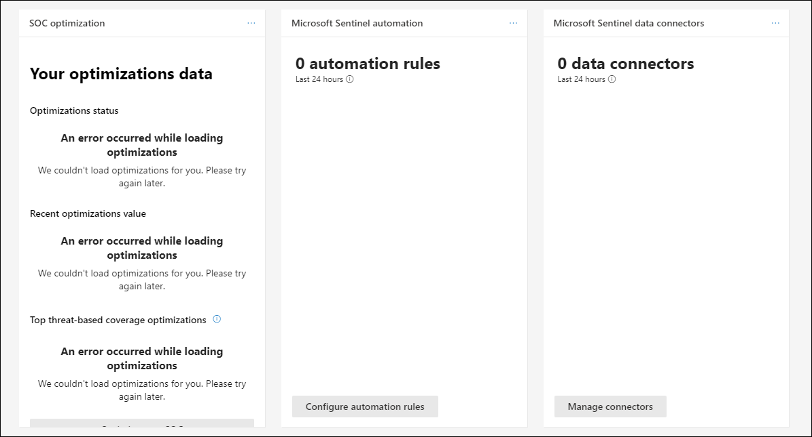

1. The cards displayed can be customized to your preference.  Select **+ Add cards**. A Window opens indicating that you already have all the cards on your home page.  Close the window by select the **X** on top-right corner of the window.
   
     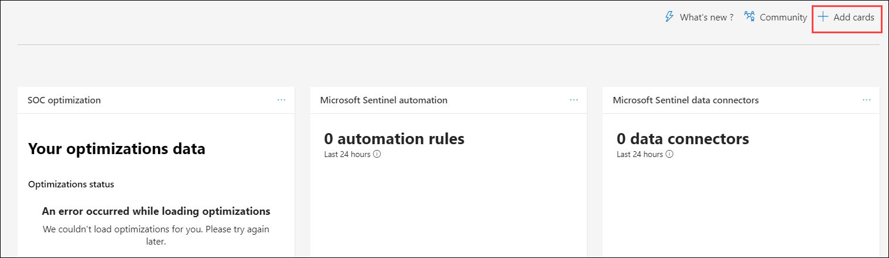
   
     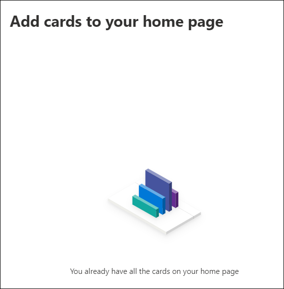
   
1. Selecting the ellipses on the top-right of any card will provide the option to **Remove**.  

     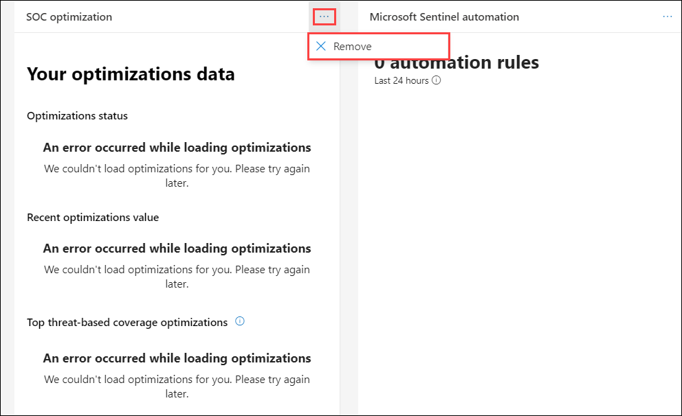

1. You can also move the cards around. Hover your mouse cursor over the title bar of any card,  when you will get a cross shaped cursor select the card and move it to your desired location.
   
     

1. Selecting the title of a card will take you to additional information for that topic. You'll explore this in the next task.

1. The left navigation panel provides links/access to information that is part of Microsoft’s Extended Detection and Response (XDR solution) which includes incidents & alerts, hunting, action center, threat analytics, secure score and more.  It also includes quick access to Microsoft Defender for Endpoint (the links listed under Endpoints, Defender for Office for 365 (links listed under Email and Collaboration), Microsoft Defender for Cloud Apps (links under Cloud apps).  Explore these options by selecting some of the links.   To return to the home page of the Microsoft 365 Defender portal, select **Home** on the left navigation panel.

     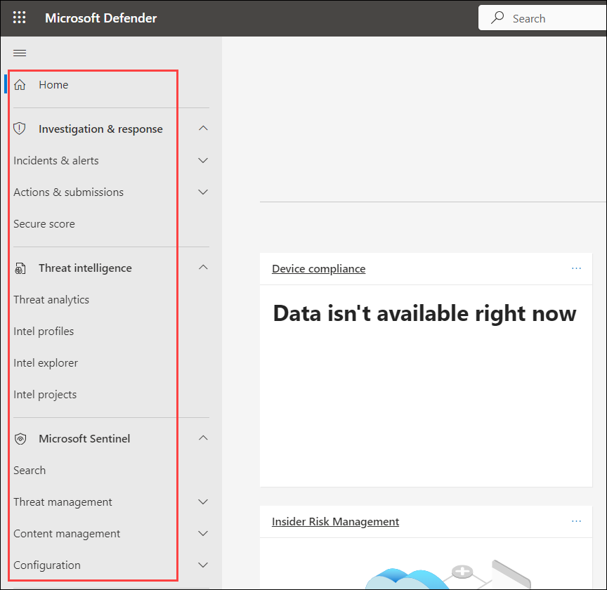

1. Keep the browser window open.

## Task 2: Explore on Microsoft Secure Score

In this task, you will explore how Microsoft Secure Score can help an organization improve its security posture.

1. From the Welcome page of the Microsoft 365 Defender portal, select **Microsoft Secure Score**, from the title bar of the card (the text will turn blue).  Alternatively, you can select **Secure score** from the left navigation panel.
 
     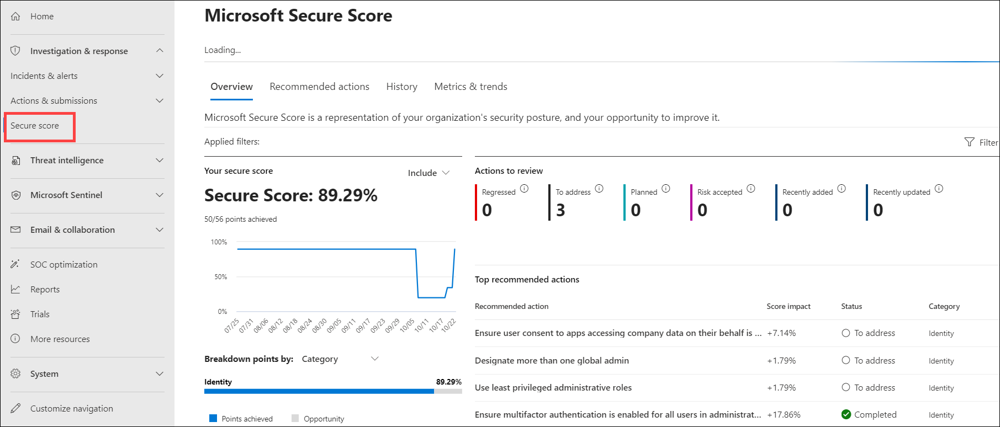

1. The Microsoft Secure Score page opens to the Overview tab.  Microsoft Secure Score is a measurement of an organization's security posture. Your organization’s secure score is shown as a percentage, along with the number of points you've achieved out of the total possible points and broken down by category. Select **Include**, next to where it says Your secure score.  A small window opens that allows you to include the achievable score, Planned score, and Current license score in the breakdown of your organization's secure score.  Select  **Include** again to close the window.

     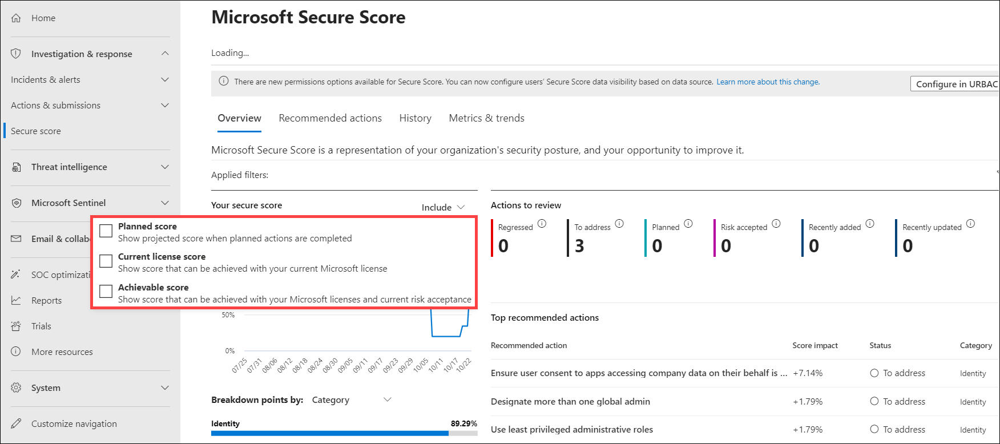

1. The overview page also includes top improvement actions, comparison score, history, and additional resources.

     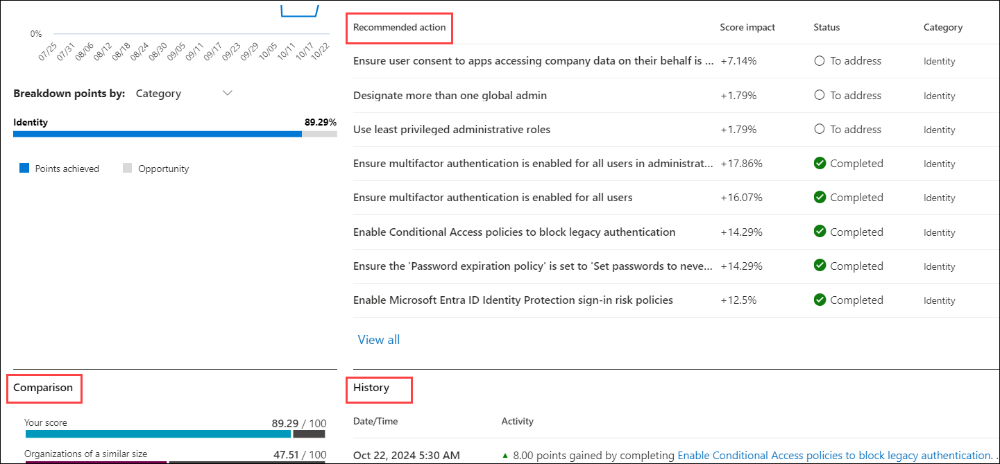

1. Select **Recommended actions (1)** from the top of the page. Notice the information available in the table. Select the **first items (2)** from the list and review the available information in the window that opens.

     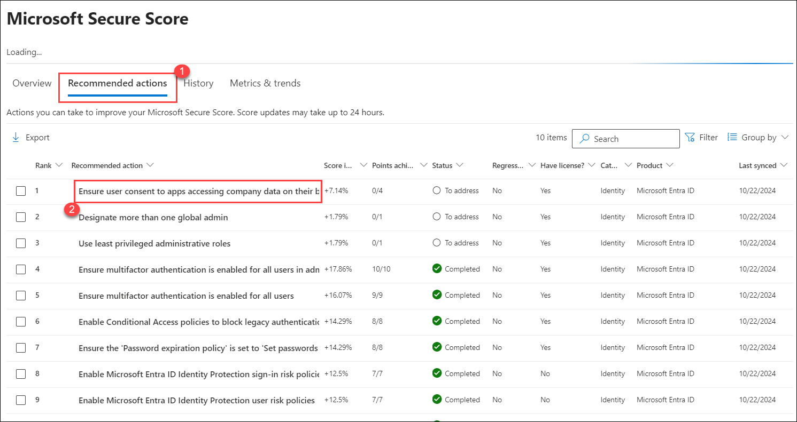

1. Select **Edit status & action plan**. In the window that opens, note the status options available. Select the **X** at the top right corner to close this window.

   > **Note :** Skip this step if the **Edit status & action plan** option is not clickable.

     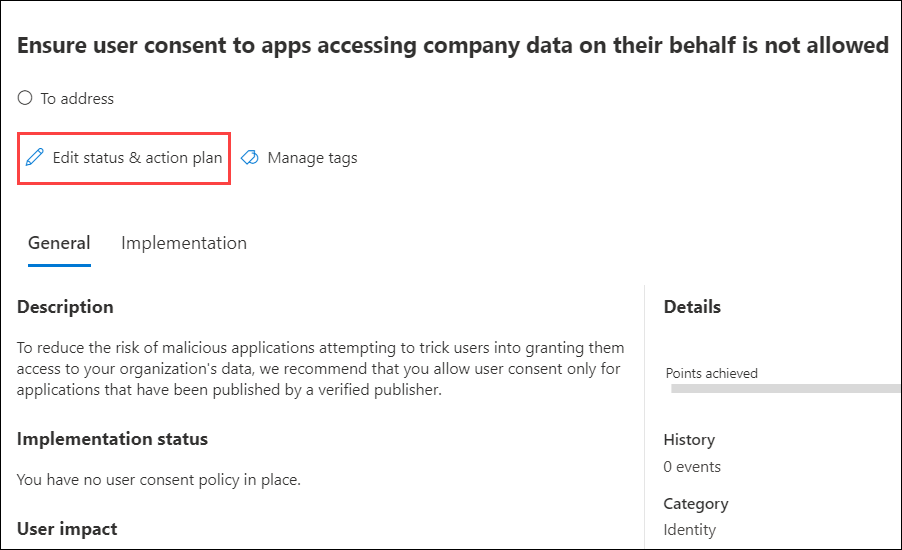

     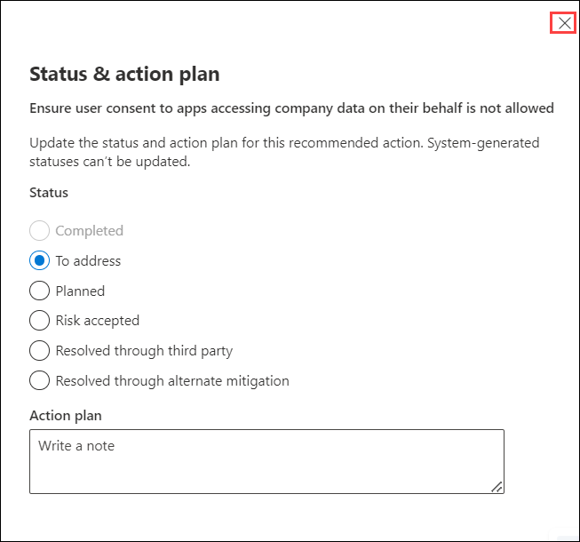

1. Now, select the **Implementation (1)** tab to view the information related to implementation. Select the **X (2)** at the top right corner to close this window.

     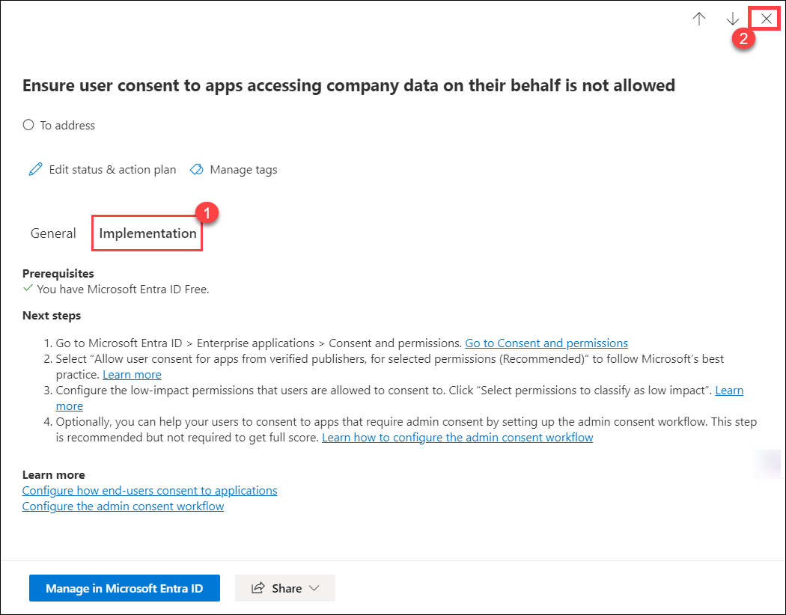

1. Select the **History (1)** tab from the top of the page. Select an **item (2)** from the history table. 

     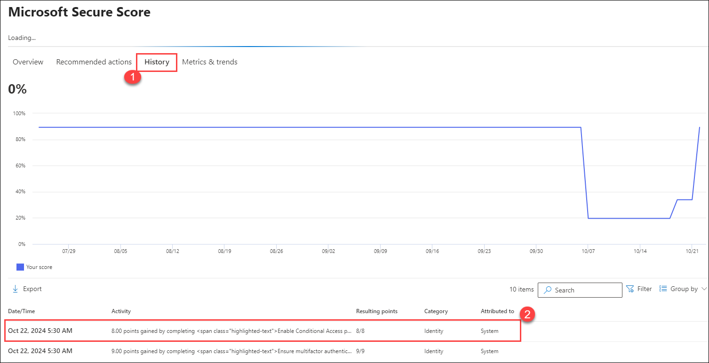

1. When a detailed page for the selected item opens, explore the options available. To exit out of the details page and return to the History page, select the **X** on the top-right corner of the page.

     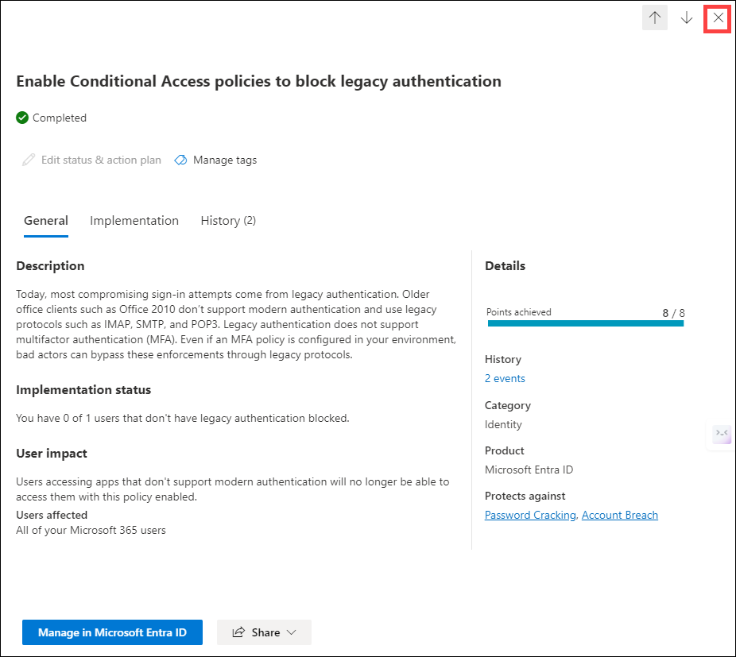

1. From the top of the page, select **Metrics & trends (1)**.  Note the available information. From the top-right corner of the page, select the **calendar icon (2)**. You can narrow down the view to a custom date range.

     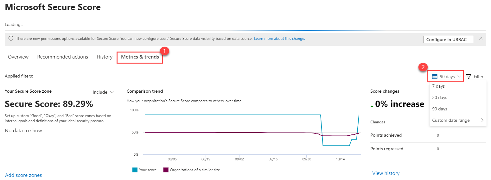

1. Select the **filter** icon to filter the view by Identity, Apps, Devices, and Data. To return to the Microsoft 365 Defender home page, select the **X** on the top-right corner. Choose **Home** from the left navigation panel.

    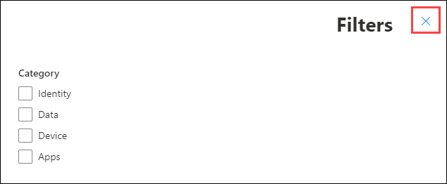
    
    
    >**Note:** If you can't see details on the **History** and **Metrics & treads** tabs, this is because after making configuration changes. it will take about 24 hours to update.
    
    >**Note:** For more details visit: https://learn.microsoft.com/en-us/microsoft-365/security/defender/microsoft-secure-score?view=o365-worldwide
    
1. Close the browser page.

## Review
In this lab, you have completed:
- Explore the Microsoft 365 Defender landing page
- Explore on Microsoft Secure Score

## You have successfully completed the lab
