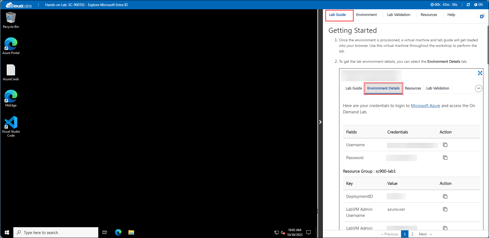
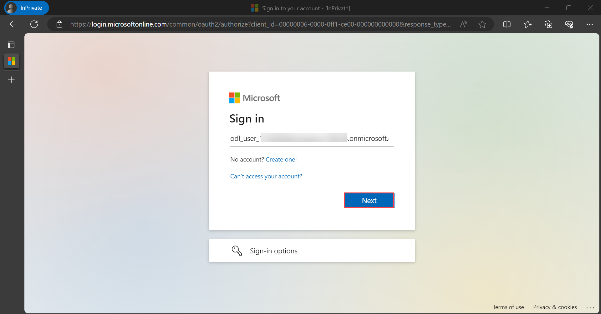
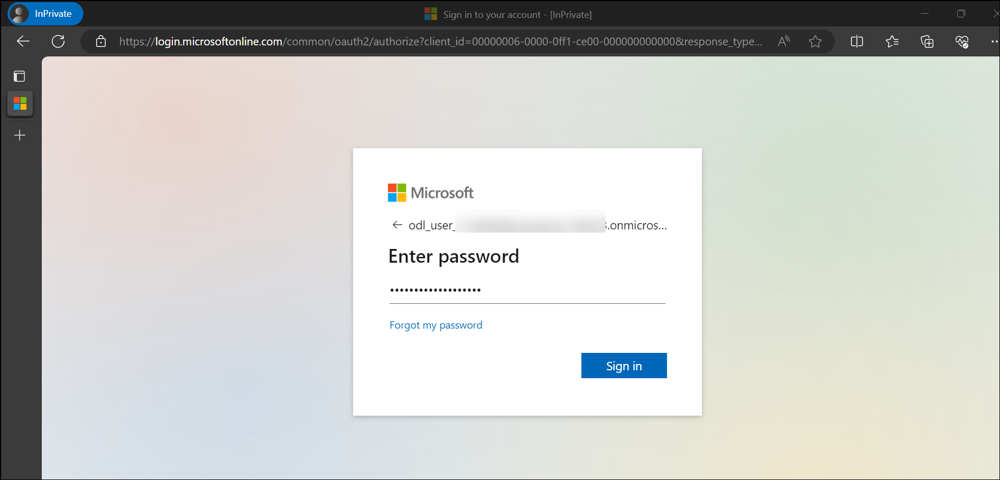

# Getting Started with Your SC-900: Microsoft Security, Compliance, and Identity Fundamentals Workshop
 
Welcome to your SC-900: Microsoft Security, Compliance, and Identity Fundamentals workshop! We've prepared a seamless environment for you to explore and learn about Azure services. Let's begin by making the most of this experience:
 
## Accessing Your Lab Environment
 
Once you're ready to dive in, your virtual machine and lab guide will be right at your fingertips within your web browser.
 

### Virtual Machine & Lab Guide
 
Your virtual machine is your workhorse throughout the workshop. The lab guide is your roadmap to success.
 
## Exploring Your Lab Resources
 
To get a better understanding of your lab resources and credentials, navigate to the **Environment Details** tab.
 

 
## Utilizing the Split Window Feature
 
For convenience, you can open the lab guide in a separate window by selecting the **Split Window** button from the top right corner.
 

 
## Managing Your Virtual Machine
 
Feel free to start, stop, or restart your virtual machine as needed from the **Resources** tab. Your experience is in your hands!
 

 
## **Lab Duration Extension**

1. To extend the duration of the lab, kindly click the **Hourglass** icon in the top right corner of the lab environment. 

    

    >**Note:** You will get the **Hourglass** icon when 10 minutes are remaining in the lab.

2. Click **OK** to extend your lab duration.
 
   

3. If you have not extended the duration prior to when the lab is about to end, a pop-up will appear, giving you the option to extend. Click **OK** to proceed.

## Let's Get Started with Azure Portal
 
1. On your virtual machine, click on the Azure Portal icon as shown below:
 
    .png)

 
2. You'll see the **Sign into Microsoft Azure** tab. Here, enter your credentials:
 
   - **Email/Username:** <inject key="AzureAdUserEmail"></inject>
 
    
 
3. Next, provide your password:
 
   - **Password:** <inject key="AzureAdUserPassword"></inject>
 
   
 
4. If prompted to stay signed in, you can click "No."
 
5. If a **Welcome to Microsoft Azure** pop-up window appears, simply click "Maybe Later" to skip the tour.
 
6. Click "Next" from the bottom right corner to embark on your Lab journey!
 
     .png)

### Log in to Microsoft 365 Admin Centre

1. In the virtual machine (VM) on the left, click on Microsoft Edge shortcut as shown below.

    .png)

    >**Note**:On the Welcome to Microsoft Edge page, select **Start without your data** and on the help for importing Google browsing data page, select the **Continue without this data** button. Then, proceed to select **Confirm and start browsing** on the next page
1. Open Microsoft Edge. In the address bar enter **admin.microsoft.com**. Please open this in a new private window.

      

1. In the Sign in window, sign in with your admin credentials.
   * Username: <inject key="AzureAdUserEmail"></inject>

       
1. Now enter the password and click on Sign in.
  
    1.  Get the user credentials provided in the environment details page and paste the value in the username section and then select **Next**.
     
    1. Enter the admin password which should be provided by your lab hosting provider. Select **Sign in**.
        * Password: <inject key="AzureAdUserPassword"></inject>
    
        
     
    1. When prompted to protect the account, Please select **Skip for now**.
   
    1. When prompted to Action Required, Please select **Ask later**

    1. When prompted to stay signed- in, select **Yes**. This takes you to the Microsoft 365 admin center page.
 
Now you're all set to explore the powerful world of technology. Feel free to reach out if you have any questions along the way. Enjoy your workshop!

